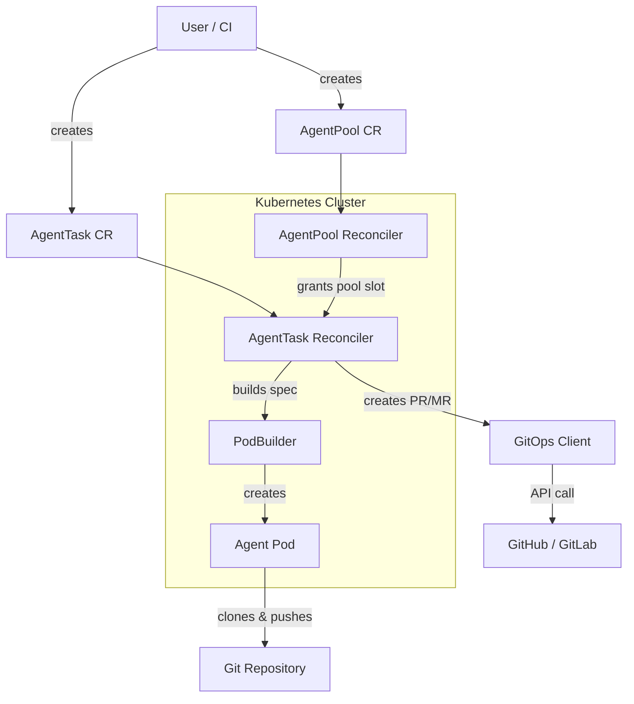
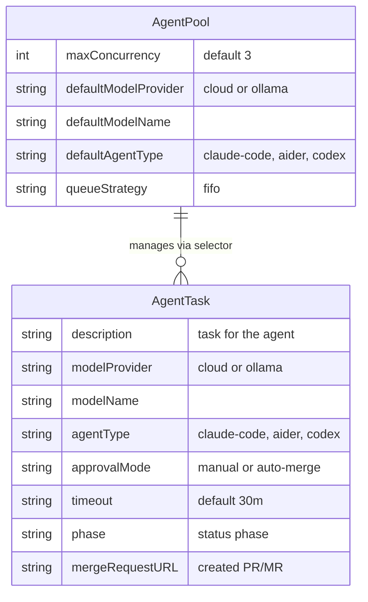
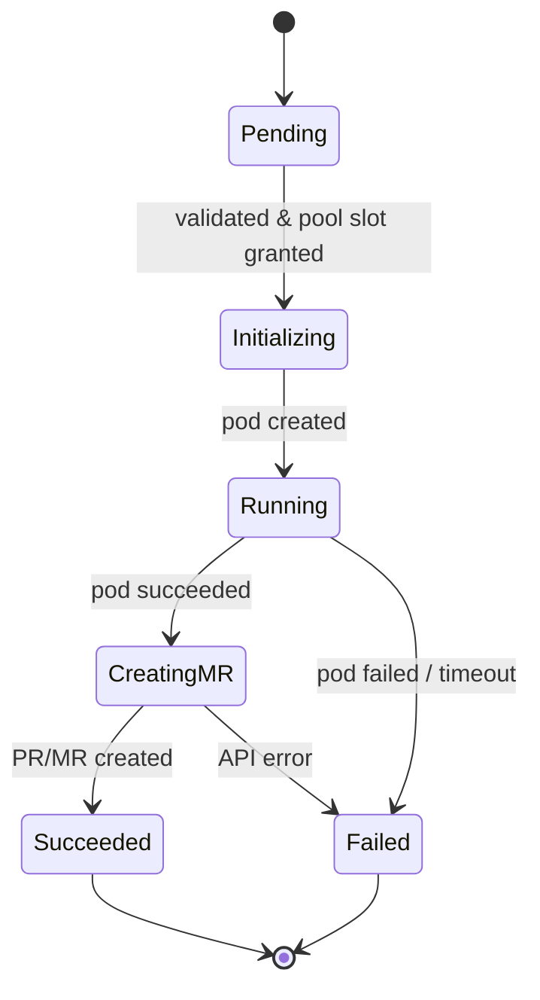
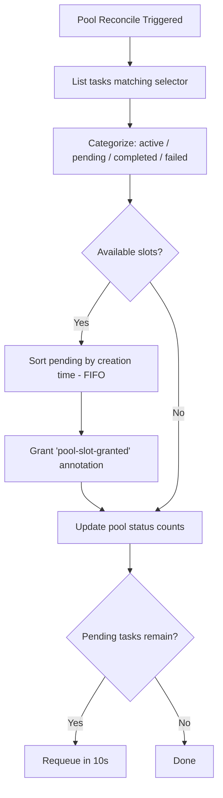
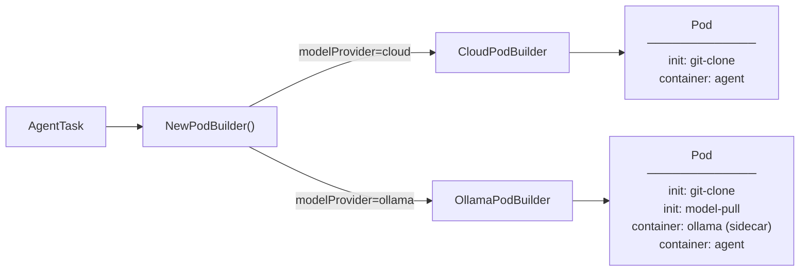
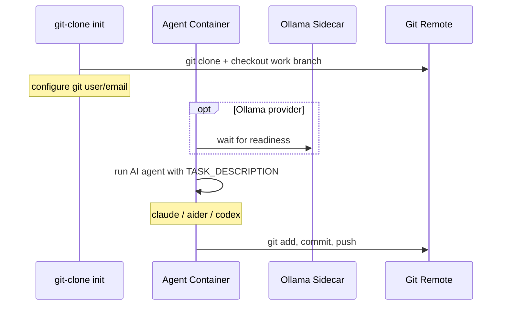
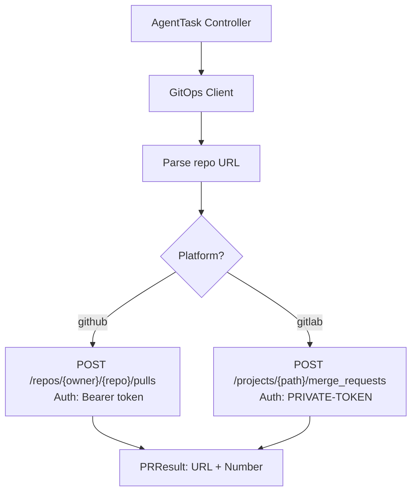

# Architecture

kbrain is a Kubernetes operator that orchestrates AI coding agents (Claude Code, Aider, Codex) to automate software development tasks. It manages the full lifecycle: pod creation, agent execution, and pull/merge request creation.

## High-Level Overview



## Custom Resource Definitions

Two CRDs drive the system:



### AgentTask

Defined in `api/v1alpha1/agenttask_types.go`. Represents a single coding task.

| Field | Description |
|-------|-------------|
| `spec.description` | Task description passed to the AI agent |
| `spec.modelProvider` | `cloud` (API-based) or `ollama` (local) |
| `spec.agentType` | `claude-code`, `aider`, or `codex` |
| `spec.git` | Repository URL, base/work branches, platform |
| `spec.approvalMode` | `manual` (default) or `auto-merge` |
| `spec.apiKeySecretRef` | Secret reference for model API key |
| `spec.gitCredentialsSecretRef` | Secret reference for git token |
| `spec.ollamaConfig` | Ollama sidecar settings (image, GPU) |
| `spec.timeout` | Task timeout (default `30m`) |
| `spec.poolRef` | Optional reference to an AgentPool |

### AgentPool

Defined in `api/v1alpha1/agentpool_types.go`. Controls concurrency and provides defaults for a group of tasks.

| Field | Description |
|-------|-------------|
| `spec.maxConcurrency` | Maximum concurrent agents (default 3) |
| `spec.selector` | Label selector matching tasks to this pool |
| `spec.queueStrategy` | `fifo` (priority planned) |
| `spec.defaultModelProvider` | Default model provider for matched tasks |
| `spec.defaultAgentType` | Default agent type for matched tasks |

## AgentTask Lifecycle

The `AgentTaskReconciler` (`internal/controller/agenttask_controller.go`) implements a state machine:



### Phase Details

| Phase | Actions |
|-------|---------|
| **Pending** | Validate fields, check pool slot availability, verify secrets exist |
| **Initializing** | Build pod spec via PodBuilder, create pod with owner reference, record start time |
| **Running** | Monitor pod status, enforce timeout, requeue every 15s |
| **CreatingMR** | Resolve git credentials, call GitHub/GitLab API, record MR URL |
| **Succeeded / Failed** | Terminal states, no further reconciliation |

## AgentPool Reconciliation

The `AgentPoolReconciler` (`internal/controller/agentpool_controller.go`) manages task queuing:



## Pod Construction

The `podbuilder` package (`internal/podbuilder/`) uses a factory pattern to build pods based on model provider.



### Cloud Provider Pod

Simple pod with a git-clone init container and the agent container. The model API key is injected as an environment variable (`ANTHROPIC_API_KEY`, `OPENAI_API_KEY`).

### Ollama Provider Pod

More complex pod with:
- **Ollama sidecar** — runs the Ollama server on port 11434 with a startup probe (5m timeout). Supports GPU via `nvidia.com/gpu` resource limits.
- **Model pull init container** — waits for the Ollama server, then pulls the model via `POST /api/pull`.
- **Agent container** — communicates with Ollama at `http://localhost:11434`.

## Agent Execution Flow

Each agent type has a Docker entrypoint (`docker/entrypoints/`) that follows the same pattern:



### Supported Agents

| Agent | Entrypoint | Key Flags |
|-------|-----------|-----------|
| **Claude Code** | `claude-entrypoint.sh` | `--allowedTools Bash,Read,Write,Edit,Glob,Grep` |
| **Aider** | `aider-entrypoint.sh` | `--yes-always --no-auto-commits` |
| **Codex** | `codex-entrypoint.sh` | `--approval-mode full-auto` |

## GitOps Integration

The `gitops` package (`internal/gitops/gitops.go`) creates pull/merge requests after the agent pushes code:



## Project Structure

```
kbrain/
├── api/v1alpha1/           # CRD type definitions (AgentTask, AgentPool)
├── cmd/main.go             # Operator entrypoint, manager bootstrap
├── config/
│   ├── crd/                # Generated CRD manifests
│   ├── rbac/               # RBAC roles and bindings
│   ├── manager/            # Operator deployment manifest
│   ├── samples/            # Example CR manifests
│   └── default/            # Kustomize overlays
├── docker/
│   ├── Dockerfile.agent-*  # Agent container images
│   ├── Dockerfile.operator # Operator image
│   └── entrypoints/        # Agent shell scripts
├── internal/
│   ├── controller/         # Reconcilers (AgentTask, AgentPool)
│   ├── podbuilder/         # Pod spec construction (cloud, ollama)
│   └── gitops/             # GitHub/GitLab PR/MR creation
└── test/                   # E2E and unit tests
```

## Key Design Decisions

- **Owner references** on pods enable automatic cleanup when tasks are deleted.
- **Finalizers** ensure proper resource cleanup during task deletion.
- **Pool slot annotation** (`kbrain.io/pool-slot-granted`) decouples pool scheduling from task reconciliation — the pool controller grants slots, and the task controller checks for them.
- **Factory pattern** in podbuilder makes it straightforward to add new model providers.
- **Entrypoint scripts** keep agent-specific logic outside the operator, allowing independent updates to agent containers.
